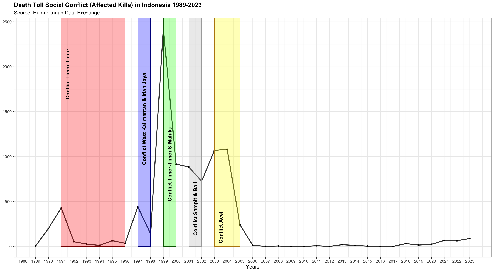
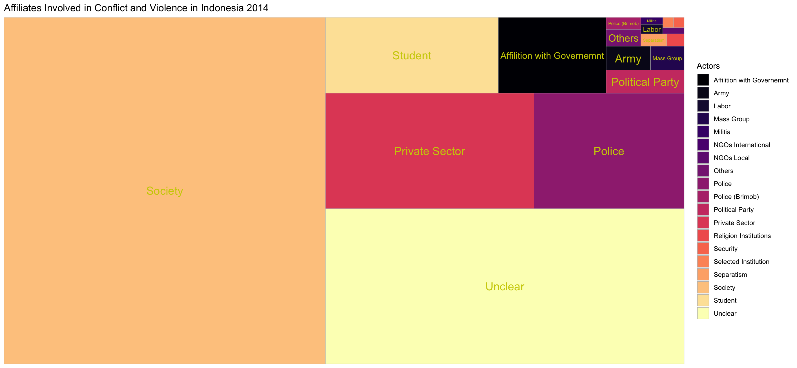
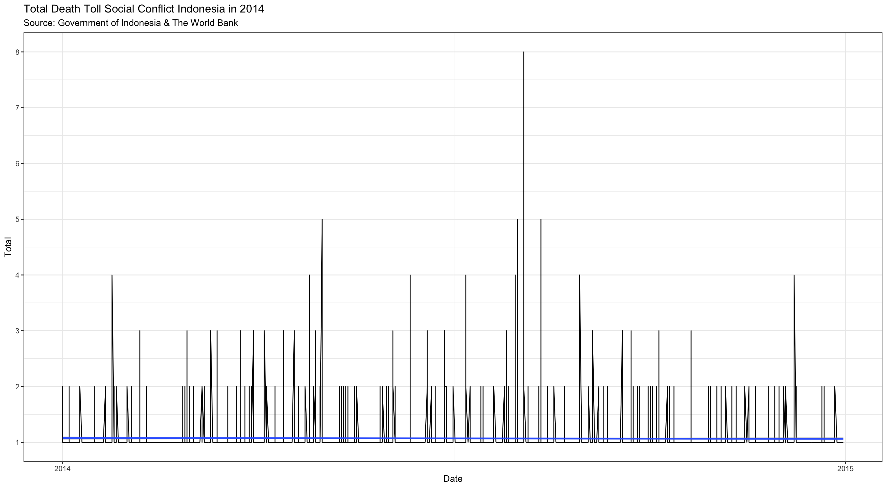
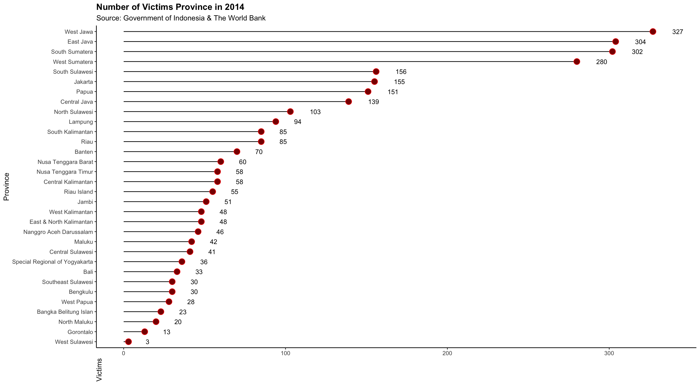

# SOCIAL CONFLICT'S IN INDONESIA 
From R-Studio, this project tries to do a new innovation analysis of social conflict in Indonesia, collecting conflict data from [The Humanitarian Data Exchange](https://data.humdata.org/dataset/ucdp-data-for-indonesia) and [Data World Bank](https://microdata.worldbank.org/index.php/catalog/2626/data-dictionary/F1?file_name=DATA%20SNPK%202014_JRI%2030%2011%202015), and this project also explains a little about social conflict in Indonesia by region. I hope this data becomes an open source for peoples.

## Affected Kills Social Conflict in Indonesia 1989-2023
### Read Data Base & Manipulation Data 
```r{}
dataconflictindonesia <-read.table("/Users/mymac/Desktop/Data Github/data_conflict", sep = ",", header = FALSE)
colnames(dataconflictindonesia) <-c("Years", "Province", "Affected")
View(dataconflictindonesia)
print(dataconflictindonesia)

library(tidyr)
dataconflictindonesia <- dataconflictindonesia %>% arrange(Years) #sort data to years
View(dataconflictindonesia)

library(writexl)
write_xlsx(dataconflictindonesia, "dataconflictindonesia.xlsx") # Import Data set to xlsx Excel
getwd()

library(readxl)
datasocialconflictidn <- read_excel("~/Desktop/Data Github/datasocialconflictidn.xlsx")
View(datasocialconflictidn) # manipulation data from 1887 to 68 with excel

library(knitr)
datasocialconflictidnmarkdown <-kable(datasocialconflictidn, format = "markdown") 
print(datasocialconflictidnmarkdown)
```

| Years| Affected|
|-----:|--------:|
|  1989|        7|
|  1990|      200|
|  1991|      429|
|  1992|       53|
|  1993|       27|
|  1994|       12|
|  1995|       65|
|  1996|       36|
|  1997|      441|
|  1998|      141|
|  1999|     2421|
|  2000|      917|
|  2001|      884|
|  2002|      726|
|  2003|     1069|
|  2004|     1082|
|  2005|      242|
|  2006|       13|
|  2007|        2|
|  2008|        6|
|  2009|        0|
|  2010|        0|
|  2011|        9|
|  2012|        1|
|  2013|       20|
|  2014|       12|
|  2015|        4|
|  2016|        0|
|  2017|        2|
|  2018|       32|
|  2019|       16|
|  2020|       24|
|  2021|       68|
|  2022|       64|
|  2023|       89|


### Death Toll Social Conflict in Indonesia 1989-2023

```r{}
ggplot(datasocialconflictidn, aes(x = Years, y = Affected)) +
  geom_line(size = 1, alpha = 0.8, color = "black") +
  geom_point(size = 1) +
#shaded for conflict
  annotate("rect", xmin = 1991, xmax = 1996, ymin = 0, ymax = Inf, fill = "red", alpha = 0.3, color = "darkred") +
  annotate("rect", xmin = 1997, xmax = 1998, ymin = 0, ymax = Inf, fill = "blue", alpha = 0.3, color = "darkblue") +
  annotate("rect", xmin = 1999, xmax = 2000, ymin = 0, ymax = Inf, fill = "green", alpha = 0.3, color ="darkgreen") +
  annotate("rect", xmin = 2001, xmax = 2002, ymin = 0, ymax = Inf, fill = "grey", alpha = 0.3, color = "darkgrey") +
  annotate("rect", xmin = 2003, xmax = 2005, ymin = 0, ymax = Inf, fill = "yellow", alpha = 0.3, color = "darkgoldenrod") +
  # add text for conflict
  annotate("text", x = 1991.5, y = max(datasocialconflictidn$Affected) -500,
           label = "Conflict Timor-Timur", color = "black", angle = 90, fontface = "bold") +
  annotate("text", x = 1997.5, y = max(datasocialconflictidn$Affected) -1000,
           label = "Conflict West Kalimantan & Irian Jaya", color = "black", angle = 90, fontface = "bold") +
  annotate("text", x = 1999.5, y = max(datasocialconflictidn$Affected) -1500,
           label = "Conflict Timor-Timor & Maluku", color = "black", angle = 90, fontface = "bold") +
  annotate("text", x = 2001.5, y = max(datasocialconflictidn$Affected) -2000,
           label = "Conflict Sampit & Bali", color = "black", angle = 90, fontface = "bold") +
  annotate("text", x = 2003.5, y = max(datasocialconflictidn$Affected) -2200,
           label = "Conflict Aceh", color = "black", angle = 90, fontface = "bold") +
  theme_bw() +
  scale_x_continuous(breaks = seq(1898, 2023, by = 1)) +
  labs(x = "Years", y = NULL, 
       title = "Death Toll Social Conflict (Affected Kills) in Indonesia 1989-2023",
       subtitle = "Source: Humanitarian Data Exchange") +
  theme(plot.title = element_text(face = "bold"))

```


### Death Toll of Social Conflict in Indonesia 
The graph above shows the number of first fatalities from 1999 to 2001 the highest number of fatalities in the East Timor and Maluku conflicts, showing a range of 2500 victims in this period. Then from 2004 - 2005 there was a significant increase in the Aceh conflict with the number of victims above 500. After 2005, the graph shows a decrease in the number of victims of the conflict during this period. Social conflict in Indonesia is low, and the number of fatalities is very low due to social conditions.

##  [Indonesia: National Violence Monitoring System 2014](https://microdata.worldbank.org/index.php/catalog/2626/study-description)
This section tries to analyze the database of the 2014 National Violence Monitoring System, I will make innovations in data analysis, collecting databases on information on acts of violence between individuals or groups that have psychological impacts. The total observation data collected amounted to 28046 data case and 100 variable.
This section only [analyzes variables](https://microdata.worldbank.org/index.php/catalog/2626/data-dictionary/F1?file_name=DATA%20SNPK%202014_JRI%2030%2011%202015) Affiliation involved in conflict and violence & Number of fatalities.

### Data Bese & Data Manipulation  
```r{}
library(haven)
datasnpk <- read_sav("/Users/mymac/Desktop/Data Github/datasnpk2015.sav")

library(writexl) # import to 
write_xlsx(datasnpk, "datasnpk2014.xlsx")
getwd()

library(readxl)
datasnpk2014 <- read_excel("~/Desktop/Data Github/datasnpk2014.xlsx")
datasnpk2014$tanggal_kejadian <- as.Date(datasnpk2014$tanggal_kejadian, format = "%d/%m/%Y")

print(datasnpk2014) # view data

# import data set & subset data from spnk2014
library(readxl)
totalactors <- read_excel("~/Desktop/Data Github/totalactors.xlsx")
View(totalactors) 

# (1) Unclear                      : 6652
# (2) Others                       : 70
# (3) Militia                      : 18
# (4) Society                      : 13238
# (5) Affiliation with Government  : 973
# (6) Selected Institution         : 13
# (7) NGOs International           : 0
# (8) NGOs Local                   : 16
# (9) Private Sector               : 2858
# (10) Political Party             : 215
# (11) Religion Institution        : 26
# (12) Labor                       : 25
# (13) Mass Group                  : 96
# (14) Army                        : 126
# (15) Police                      : 2062
# (16) Police Brimob               : 49
# (17) Separatism                  : 38
# (18) Student                     : 1559
# (19) Security                    : 13

```
### Affiates Involved in Conflict and Violance in Indonesia 2014 
```r{}

library(treemap)
library(treemapify)
library(ggplot2)
library(viridis)


ggplot(totalactors, aes(area = Total, fill = Actors, label = Actors)) +
  geom_treemap() +
  geom_treemap_text(colour = "yellow3", place = "centre", grow = FALSE, size = 15) +
  scale_fill_viridis_d(option = "magma") +
  labs(title = "Affiliates Involved in Conflict and Violence in Indonesia 2014") +
  theme(legend.background = "none",
        plot.background = element_rect(fill = "black"),
        panel.background = element_rect(fill = "black"),
        plot.title = element_text(color = "white")) +
  theme(plot.title = element_text(face = "bold")) +
  theme_classic()

````




### Interpretation Affiliation Involved Social Conflict in Indonesia 2014
The interpretation tree map is very simple, we can now make a conclusion, having two dominant actors, the first such as “Community”, “Police”, and “Private Sector” which shows the dominance of conflict and violence in the analysis data. Because they are in a larger box area than the other actors. The second smaller actor such as “Affiliation with government” and “Political Party” in less area, they show relatively smaller to larger involvement.


## Data Death Toll Social Conflict Indonesia in 2014
### Read Data Base

```r{}
data base did manipulation in sub Affiates Involved in Conflict and Violance in Indonesia 2014 

library(dplyr)
filtered_dataspnk2024 <- datasnpk2014 %>%
  filter(kil_total != 0) # filter data for point 0 in variable kill_total

print(filtered_dataspnk2024$jenis_kek)
   [1] 2 2 2 2 1 2 4 2 2 2 1 1 2 2 2 2 1 2 4 3 2 2 2 2 3 1 2 3 3 2 2 2 1 2 2 2 1 3
  [39] 2 2 2 3 2 2 2 2 3 1 2 2 2 2 3 3 1 2 1 2 2 2 2 2 2 2 4 2 2 2 1 3 1 2 2 2 2 2
  [77] 3 4 1 2 3 2 2 2 1 1 3 3 2 1 3 2 2 1 1 2 2 1 2 2 4 2 3 2 2 1 2 1 2 2 2 2 2 2
 [115] 2 2 3 2 1 2 2 2 1 2 2 3 2 2 2 2 2 2 1 2 2 2 2 3 2 2 2 3 3 3 4 2 2 1 1 2 1 2
 [153] 2 3 2 3 4 2 3 1 2 2 2 3 1 1 2 3 2 2 2 4 3 2 3 2 1 2 3 2 4 1 2 2 2 2 1 2 2 2
 [191] 1 2 2 2 2 1 1 2 2 2 2 2 2 3 4 1 2 2 4 2 2 2 2 2 2 2 2 1 2 1 2 1 3 2 2 2 2 1
 [229] 2 2 2 2 1 2 2 4 2 2 2 2 1 2 2 2 2 2 1 2 3 1 2 1 2 2 2 2 2 2 2 2 3 1 2 2 3 2
 [267] 2 2 2 2 2 2 1 2 1 3 1 1 2 2 2 4 3 2 1 1 1 2 2 3 2 2 2 1 3 3 4 2 2 1 2 1 2 2
 [305] 1 2 2 2 2 1 2 2 2 2 2 1 3 2 2 3 3 2 3 2 2 1 2 2 1 2 2 2 1 2 2 2 2 1 4 2 2 2
 [343] 1 3 2 2 1 2 2 3 2 2 2 2 2 2 1 1 1 1 2 2 2 1 4 4 2 3 1 2 2 2 2 2 2 2 1 2 3 2
 [381] 2 2 4 2 2 2 3 2 3 2 2 2 2 2 2 2 2 2 2 2 1 3 2 3 2 2 2 2 2 2 2 4 3 2 2 2 2 2
 [419] 2 2 2 2 3 2 1 2 3 3 2 3 1 1 3 2 2 3 2 1 4 1 2 2 2 1 2 2 2 2 2 2 2 2 2 1 2 3
 [457] 2 2 2 2 2 2 2 1 1 1 2 2 1 1 2 2 2 2 1 2 2 2 2 2 2 2 3 3 1 2 3 3 2 4 2 2 1 2
 [495] 2 2 2 2 2 2 3 2 2 2 4 3 2 3 2 1 2 1 2 1 2 2 2 2 2 2 2 3 3 2 3 2 2 1 2 3 2 2
 [533] 3 3 1 2 2 2 2 1 3 2 2 2 4 2 2 4 3 3 2 2 2 2 2 1 2 2 2 2 3 2 2 3 1 2 2 2 1 2
 [571] 2 2 2 2 1 3 1 2 2 2 3 2 4 2 3 2 2 2 1 2 1 2 2 2 2 2 4 2 2 2 2 2 2 2 2 2 2 2
 [609] 3 1 2 2 2 1 1 3 2 2 2 1 2 2 2 2 1 2 2 2 2 2 2 2 2 4 4 4 2 2 2 2 4 3 2 2 2 1
 [647] 1 2 2 1 2 2 2 2 1 2 2 2 2 2 2 4 2 2 2 1 2 2 2 3 3 1 1 2 2 1 2 2 2 2 2 2 2 2
 [685] 2 2 3 4 4 4 4 1 1 1 2 2 2 2 2 2 2 2 2 2 2 2 2 2 2 2 1 1 2 4 2 4 4 4 2 2 2 2
 [723] 2 2 2 1 2 2 2 2 2 2 2 1 2 2 2 3 2 2 2 2 2 1 2 2 2 2 2 1 2 3 2 3 2 2 2 1 2 2
 [761] 3 2 4 3 1 1 1 2 3 2 2 1 3 2 2 2 1 2 2 2 1 2 2 3 2 2 4 1 3 1 4 2 1 2 1 4 1 2
 [799] 2 2 1 1 2 2 2 2 1 2 1 2 1 2 2 2 2 2 2 2 2 2 2 1 2 1 4 1 2 2 2 4 3 2 1 2 4 2
 [837] 1 1 1 4 2 2 2 2 1 2 1 2 2 2 2 2 2 3 2 2 2 3 2 2 2 2 2 3 2 3 2 2 2 2 2 2 3 2
 [875] 2 3 2 1 2 2 2 3 2 2 2 2 2 2 2 3 2 1 2 2 2 2 2 2 3 2 2 2 2 2 3 2 2 2 2 1 2 1
 [913] 2 3 3 2 2 1 1 1 1 2 2 2 3 2 1 2 3 3 2 3 2 2 3 2 2 1 1 2 1 2 2 2 2 4 2 2 2 2
 [951] 4 2 2 4 2 2 3 3 1 1 2 2 3 2 3 2 2 2 1 4 2 2 2 2 4 3 2 2 2 2 3 1 3 4 2 2 2 2
 [989] 2 2 4 2 2 2 4 3 1 3 2 3
 [ reached getOption("max.print") -- omitted 1783 entries ]
```
### Result Analysis and Graph for Data Death Toll Social Conflict Indonesia in 2014

```r{}
ggplot(filtered_dataspnk2024, aes(tanggal_kejadian, y = kil_total)) +
  geom_line(color = "black") +
  geom_smooth(method = "lm", formula = y~log(x)) +
  labs(x = "Date", y = "Total",
       subtitle = "Source: Government of Indonesia & The World Bank") +
  ggtitle("Total Death Toll Social Conflict Indonesia in 2014") +
  scale_x_date(date_breaks = "1 years", date_labels = "%Y") +
  theme(axis.text = element_blank()) +
  scale_y_continuous(breaks = seq(1, 19, by = 1)) +
  theme_bw() 
```



### Death Toll Social Conflict Indonesia During in 2014 
Time representation of variable X from early 2014 to late 2014, each vertical line graph in social conflict and variable Y shows the number of fatalities of each conflict incident. On the blue line of `geom_smooth` aims to show the range of fatalities due to the impact of social conflict mostly point 1, with slight fluctuations. Overall, this visualization shows a relatively spread out pattern, with several peaks of significant fatalities. The blue line shows that the average number of fatalities per social conflict incident in Indonesia in 2014 remained relatively low, at around 1 victim per incident.

## Death Toll in Each Province
### Read Data Base
```r{}
library(readxl) 
deatheachprovince <- read_excel("~/Desktop/Data Github/deatheachprovince.xlsx") # manipulation data from datasnpk2014.xlsx 
View(deatheachprovince)

library(knitr)
deatheachprovincemarkdown <-kable(deatheachprovince, format = "markdown")
print(deatheachprovincemarkdown)


```

|Province                       | Total|
|:------------------------------|-----:|
|Nanggro Aceh Darussalam        |    46|
|West Sumatera                  |   280|
|Riau                           |    85|
|Jambi                          |    51|
|South Sumatera                 |   302|
|Bengkulu                       |    30|
|Lampung                        |    94|
|Bangka Belitung Islan          |    23|
|Riau Island                    |    55|
|Jakarta                        |   155|
|West Jawa                      |   327|
|Central Java                   |   139|
|Special Regional of Yogyakarta |    36|
|East Java                      |   304|
|Banten                         |    70|
|Bali                           |    33|
|Nusa Tenggara Barat            |    60|
|Nusa Tenggara Timur            |    58|
|West Kalimantan                |    48|
|Central Kalimantan             |    58|
|South Kalimantan               |    85|
|East & North Kalimantan        |    48|
|North Sulawesi                 |   103|
|Central Sulawesi               |    41|
|South Sulawesi                 |   156|
|Southeast Sulawesi             |    30|
|Gorontalo                      |    13|
|West Sulawesi                  |     3|
|Maluku                         |    42|
|North Maluku                   |    20|
|West Papua                     |    28|
|Papua                          |   151|

### Result Number of Victims Province in 2014
 
```r{}

library(ggplot2)
library(dplyr)
library(stringr)

deatheachprovince %>%
  mutate(Province = str_remove(Province, "-.*$")) %>%
  ggplot(aes(y = reorder(Province, Total), x = Total)) +
  geom_segment(aes(x = 0, xend = Total, y = reorder(Province, Total),
                   yend = reorder(Province, Total)), color = "black") +
  geom_point(size = 4, color = "red", fill = "darkred", shape = 21) +
  geom_text(aes(label = Total),
            nudge_x = 10, hjust = -0.3, vjust = 0.5, size = 3.5, color = "black") +
  labs(title = "Number of Victims Province in 2014",
       subtitle = "Source: Government of Indonesia & The World Bank",
       y = "Province",
       x = "Victims") +
  theme_classic() +
  theme(plot.title = element_text(face = "bold"),
        axis.title.x = element_text(angle = 90, hjust = 1))

```


### Provinces With The Highest Death Toll
This visualization shows that there is significant variation in the number of victims of social conflict in Indonesia in 2014, with provinces in Java and Sumatra at the top.West Java had the highest number of victims related to social conflict in Indonesia in 2014, with 327 victims. This shows that social conflict in this province is more significant than other provinces.Followed by East Java with 304 victims, and South Sumatra and West Sumatra which each had 302 and 280 victims.
